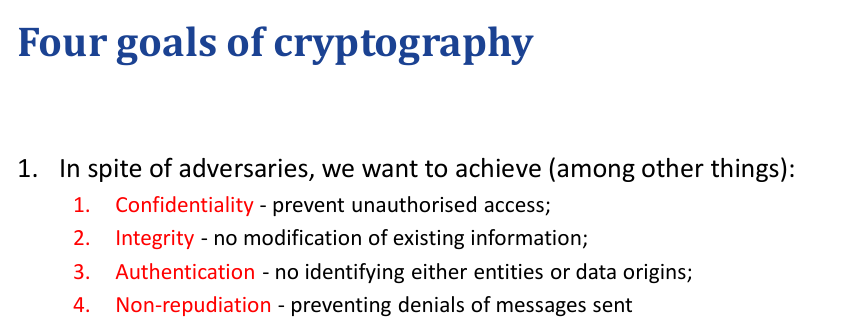

---
# 信息安全基本目标

### 一、 核心基础：CIA 三元组 (数据属性)
*这三个要素定义了数据在理想状态下应该是什么样子的。*

#### 1. 机密性 (Confidentiality)
*   **定义**：只有被授权的人或系统才能访问信息。
*   **核心问题**：**“不该看的人看不到。”**
*   **攻防示例**：
    *   攻击：网络窃听、数据泄露。
    *   防御：加密技术（AES, RSA）、物理隔离。

#### 2. 完整性 (Integrity)
*   **定义**：数据在存储或传输过程中保持准确、一致，未被篡改。
*   **核心问题**：**“数据没有被偷偷改过。”**
*   **攻防示例**：
    *   攻击：中间人篡改、SQL注入修改数据。
    *   防御：哈希校验（MD5/SHA）、数字签名。

#### 3. 可用性 (Availability)
*   **定义**：授权用户在需要时能及时、可靠地访问服务或数据。
*   **核心问题**：**“想用的时候能用。”**
*   **攻防示例**：
    *   攻击：DDoS 攻击、勒索软件锁死文件。
    *   防御：负载均衡、异地容灾备份、RAID 磁盘阵列。

---

### 二、 关键扩展：交互与信任机制 (流程属性)
*这三个要素定义了用户如何安全地使用系统，以及如何建立法律层面的信任。*

#### 4. 认证 (Authentication)
*   **定义**：验证系统实体（用户或进程）所声称的身份的过程。
*   **核心问题**：**“你是谁？”** (Verifying Identity)
*   **PPT 重点**：它是访问系统的第一道门槛。
*   **典型技术**：
    *   **Kerberos 协议**（如 PPT 所述，一种基于票据的认证协议）。
    *   密码、生物识别（指纹/人脸）、双因素认证 (2FA)。

#### 5. 访问控制 / 授权 (Access Control / Authorisation)
*   **定义**：保护系统资源，防止未经授权的访问，限制用户只能执行其权限内的操作。
*   **核心问题**：**“你能干什么？”** (Permissions)
*   **PPT 重点**：通过认证后，系统决定你能读、写还是删除。
*   **典型技术**：
    *   **ACL (访问控制列表)**：明确规定谁对哪个文件有什么权限。
    *   RBAC (基于角色的访问控制)：比如“经理”角色可以审批，“员工”角色只能提交。

#### 6. 不可否认性 (Non-repudiation)
*   **定义**：防止通信的一方在事后否认其参与了该通信或行为。
*   **核心问题**：**“这事是你干的，别赖账。”** (Proof of Involvement)
*   **PPT 重点**：主要用于保护交易和法律责任。
*   **典型技术**：
    *   **数字签名**：结合私钥加密，确保除了你没人能签出这个名。
    *   审计日志（Audit Trails）：不可篡改的操作记录。

---

### 三、 融会贯通：六大要素如何协作？

为了帮你彻底记住，我们用**“网上银行转账”**这个场景，把这 6 个概念串起来：

1.  **认证 (Authentication)**：
    你打开银行 App，输入密码和人脸识别。系统确认**你是你**。
2.  **访问控制 (Access Control)**：
    系统检测你的权限。虽然你是用户，但你**只能操作**自己的账户，**无权访问**银行的后台数据库（那是管理员的权限）。
3.  **机密性 (Confidentiality)**：
    你查看余额。余额数字通过 HTTPS **加密传输**，此时坐在你旁边蹭 Wi-Fi 的黑客截获了数据包，但也**看不懂**内容。
4.  **完整性 (Integrity)**：
    你输入“转账 100 元”。数据包传到银行服务器时，系统通过哈希校验确认数据包**依然是** 100 元，而不是被篡改成了 10000 元。
5.  **不可否认性 (Non-repudiation)**：
    你点击“确认转账”，App 使用你的私钥对交易指令进行了**数字签名**。第二天如果你打电话给银行说“我没转过这笔钱”，银行拿出你的签名记录，让你**无法抵赖**。
6.  **可用性 (Availability)**：
    即使双 11 转账的人很多，银行使用了**负载均衡**和服务器集群，保证 App **没有崩溃**，让你顺利完成了操作。

---

### 四、 总结图表

| 类别 | 概念 | 英文名称 | 核心作用 | 典型技术/协议 |
| :--- | :--- | :--- | :--- | :--- |
| **基础属性 (CIA)** | **机密性** | Confidentiality | **保密** (防泄露) | 加密 (AES, TLS) |
| | **完整性** | Integrity | **防篡改** (保真) | 哈希 (SHA), 校验和 |
| | **可用性** | Availability | **抗压** (防宕机) | 备份, 冗余, DDoS清洗 |
| **流程机制 (扩展)** | **认证** | Authentication | **验明正身** (你是谁) | **Kerberos**, 密码, 生物识别 |
| | **访问控制** | Access Control | **权限管理** (能干嘛) | **ACL**, RBAC |
| | **不可否认性** | Non-repudiation | **铁证如山** (防赖账) | 数字签名, 审计日志 |

这样整理之后，你就拥有了一个既包含**底层原理 (CIA)** 又包含**实现机制 (PPT内容)** 的完整网络安全知识框架了。

# 密码学核心目标与应用
---

### 第一步：密码学的四大核心目标
这是密码学存在的意义，也是它要解决的四个终极问题：

1.  **机密性 (Confidentiality)**
    *   **目标**：确保信息不被窃听。
    *   **手段**：**加密（Encryption）**。把明文变成乱码。
2.  **完整性 (Integrity)**
    *   **目标**：确保信息未被篡改。
    *   **手段**：**哈希函数（Hashing）**。提取数据的“指纹”。
3.  **认证 (Authentication)**
    *   **目标**：确认发信人的身份。
    *   **手段**：验证对方是否持有正确的**密钥**。
4.  **不可否认性 (Non-repudiation)**
    *   **目标**：防止事后抵赖。
    *   **手段**：**数字签名**（这是非对称加密独有的能力，对称加密做不到这一点）。

---

### 第二步：对称加密 (Symmetric Encryption)
*这是密码学的“老前辈”，历史悠久，简单粗暴。*

#### 1. 核心特点
**“一把钥匙开一把锁。”**
通信双方（Alice 和 Bob）使用**完全相同**的一把密钥（Secret Key）。
*   **加密：** Alice 用密钥 K 将明文锁住。
*   **解密：** Bob 用**同一个**密钥 K 将密文打开。

#### 2. 现实比喻
**保险箱模式**。
Alice 买了一个保险箱，设定密码是 `123456`，把文件放进去锁好。快递给 Bob。Bob 收到后，必须输入同样的 `123456` 才能打开取出文件。

#### 3. 经典算法
*   **DES / 3DES**（老旧，已不安全）
*   **AES**（目前的国际标准，极其安全，WPA2 WiFi密码用的就是这个）

#### 4. 致命弱点：密钥分发难题 (Key Distribution)
既然双方都要用同一把钥匙，Alice 第一次如何把钥匙安全地交给 Bob？
*   如果在网上直接发给 Bob，被黑客截获了怎么办？
*   如果派人送过去，成本又太高。
*   *这就好比：为了安全传输数据，我们需要一把密钥；但为了安全传输密钥，我们需要另一把密钥……陷入死循环。*

---

### 第三步：非对称加密 (Asymmetric Encryption)
*为了解决“密钥怎么给对方”的问题，天才数学家们发明了非对称加密（公开密钥加密）。*

#### 1. 核心特点
**“两把钥匙，成对出现。”**
每个人都拥有一对钥匙：
*   **公钥 (Public Key)**：公开给全世界，谁都能拿。
*   **私钥 (Private Key)**：严格保密，只有自己有，打死不能给别人。

**神其规则：**
*   用**公钥**加密的数据，**只有私钥**能解开。
*   用**私钥**加密的数据，**只有公钥**能解开。

#### 2. 两种用法（解决了不同问题）

*   **用法 A：为了机密性（加密通信）**
    *   *场景：* 我想给马云发一条机密信息。
    *   *操作：* 我拿到马云的**公钥**（满大街都是），把信锁上。
    *   *结果：* 全世界只有马云有**私钥**，所以只有他能解开。
    *   *比喻：* **信箱投递**。谁都能往邮筒（公钥）里塞信，但只有邮递员有钥匙（私钥）能把信取出来。

*   **用法 B：为了认证与不可否认性（数字签名）**
    *   *场景：* 马云发了一条公告，要证明确实是他发的。
    *   *操作：* 马云用他的**私钥**对公告进行加密（签名）。
    *   *结果：* 大家用马云的**公钥**去解。如果能解开，说明这东西只能是用马云的私钥锁的。因为私钥只有他有，所以**证明是他发的（认证）**，且他**无法赖账（不可否认性）**。

#### 3. 经典算法
*   **RSA**（最经典）
*   **ECC**（椭圆曲线加密，比特币就在用）

---

### 第四步：巅峰对决 —— 对称 vs. 非对称

理解了原理后，我们需要对比它们的优劣，因为现代网络安全（如 HTTPS）是把这两者结合起来使用的。

| 特性 | 对称加密 (Symmetric) | 非对称加密 (Asymmetric) |
| :--- | :--- | :--- |
| **密钥数量** | 单一密钥 (Shared Secret) | 密钥对 (Public + Private) |
| **加密速度** | **极快** (适合处理大数据文件) | **极慢** (比对称慢 100-1000 倍，计算复杂) |
| **安全性** | 依赖于密钥不泄露 | 数学难题 (大数分解等) 保障安全 |
| **密钥管理** | **极难** (密钥分发困难，N个人互通需要 N*(N-1)/2 把钥匙) | **容易** (公钥随意分发，私钥自己留好) |
| **功能支持** | 仅支持机密性、完整性(需结合哈希)、认证 | 支持所有目标，**独占不可否认性 (数字签名)** |
| **典型应用** | 硬盘加密、视频流加密、ZIP压缩包密码 | 身份验证、数字证书、密钥交换 |

### 总结与最佳实践

既然**对称加密快但不好传密钥**，而**非对称加密安全但速度慢**，聪明的工程师想出了**混合加密（Hybrid Encryption）**：

**HTTPS 的工作流程（简化版）：**
1.  **握手阶段（非对称）：** 浏览器和服务器先用 **RSA（非对称加密）** 建立连接。虽然慢，但只传输很少的数据——即**“会话密钥”**。
2.  **传输阶段（对称）：** 一旦双方安全地交换了“会话密钥”，后续看视频、刷网页的大量数据传输，全部切换回 **AES（对称加密）**。

# 身份认证机制
根据您提供的课件（特别是**第8页**），身份认证的三大核心要素（Authentication Factors）的定义和含义如下：

### 1. 所知 (Something you know)
*   **定义**：**知识的展示 (Demonstration of knowledge)**。即验证用户脑海中是否记得或掌握特定的信息。
*   **含义**：这是最传统的认证方式，系统假设只有真正的用户才知道这个秘密信息。
*   **课件中的例子**：密码 (password)、母亲的婚前姓氏 (mother's maiden name) 等安全问题答案。

### 2. 所有 (Something you have)
*   **定义**：**物品的持有 (Possession of an item)**。即验证用户是否拥有某个特定的物理对象。
*   **含义**：系统假设只有真正的用户才持有这个特定的物品。
*   **课件中的例子**：物理钥匙 (physical key)、大学身份证 (UoA ID card)、智能卡 (smart card)。

### 3. 所是 (Something you are)
*   **定义**：**内在特征 (Intrinsic/inherent characteristic of you)**。即验证用户本身固有的、与生俱来的生物特征。
*   **含义**：这是基于生物识别技术的认证，依靠人体独一无二的生理特征来确认身份。
*   **课件中的例子**：指纹 (fingerprint)、虹膜扫描 (iris scan) 或其他生物识别特征 (biometric)。

---
**补充说明 (来自第10页)**：
课件还提到，为了更强的安全性，现代系统通常使用 **双因素认证 (Two-factor authentication, 2FA)**，即要求用户必须提供上述三种要素中的**两种不同要素**（例如：密码+指纹，或者 密码+智能卡）。注意：提供两个同类要素（如密码+生日）不算双因素认证。  

# 4. 密码安全存储
根据提供的课件（特别是第 **7, 8, 30, 46, 53** 页），以下是对密码安全存储的详细解答和对比分析。

---

### 1. 理解为何使用密码学哈希函数是存储密码的最佳实践

**核心依据：单向性（One-way Property）与 原像抗性（Pre-image Resistance）**

根据课件第 **7页** 和 **8页** 的定义，密码学哈希函数具有**单向性（One-way）**，具体表现为**原像抗性（Pre-image Resistance）**：
*   **定义**：给定一个哈希值 $y$，要在计算上找到一个输入 $x$ 使得 $h(x) = y$ 是极其困难的。
*   **通俗理解**：你可以很容易地把“密码”变成“乱码（哈希值）”，但几乎不可能把“乱码”还原成“密码”。

**为什么这是最佳实践？（结合课件第 53 页）**
1.  **无需存储秘密**：课件第 **53页** 指出，通过哈希，系统**“避免存储完整的（秘密）认证数据”**。系统只需要存储“补充数据”（即哈希值）。
2.  **即使泄露也安全**：如果黑客攻破了数据库，拿到了密码文件，他们看到的只是一堆杂乱的哈希值。由于哈希函数的单向性（第7页），黑客无法像解密文件那样直接逆向还原出用户的真实密码。
3.  **验证流程安全**：当用户登录时，系统只需将用户输入的密码进行一次哈希运算，然后对比计算出的哈希值与数据库存储的哈希值是否一致（课件第54页 Example 1 逻辑）。系统本身都不需要知道原始密码是什么。

---

### 2. 分析并对比：加密整个文件 vs. 单独加密 vs. 哈希函数

虽然课件主要集中在哈希函数上，但我们可以根据课件中关于密钥（Key）的描述（第 43, 47 页）推导出加密方案的劣势，并与哈希进行对比。

#### 方案 A：加密整个密码文件 (Encrypting the whole file)
*   **机制**：使用对称加密算法（如 AES）将包含所有用户密码的文件加密。
*   **劣势**：
    *   **密钥单点故障**：系统为了验证用户登录，必须在内存中持有解密密钥来读取文件。如果黑客攻入服务器（通常这也是获取密码文件的前提），他们很可能也能在内存或配置文件中找到这个**密钥**。
    *   **全盘瓦解**：一旦密钥被盗，黑客可以瞬间解密**所有**用户的密码。
    *   **性能瓶颈**：每次验证可能需要解密整个文件或大块数据，效率极低。

#### 方案 B：单独加密每个密码 (Encrypting each password)
*   **机制**：对数据库中的每个密码字段单独进行加密存储。
*   **劣势**：
    *   **可逆性风险**：加密（Encryption）本质上是**双向**的（可逆的）。只要有密钥，就能还原出明文。这违反了课件第 **7页** 强调的“单向性”安全原则。
    *   **内部威胁**：拥有密钥的管理员或恶意员工可以直接还原出用户的明文密码，侵犯用户隐私（用户可能在其他网站使用相同密码）。
    *   **密钥管理困难**：同样面临密钥存储的问题。如果密钥与数据在同一台服务器上，安全性提升有限。

#### 方案 C：使用哈希函数 (Using Hash Functions) —— **推荐方案**
*   **机制**：存储 $Hash(Password)$。
*   **优势**（结合课件）：
    *   **不可逆（第7页）**：没有密钥可以窃取，因为哈希本身就不需要密钥来还原（Unkeyed Hash, 第40页）。即便黑客拿到数据，也必须通过暴力破解或字典攻击（Dictionary Attack, 第30页）来猜测密码，成本极高。
    *   **隔离性**：攻破数据库并不等于直接获得密码。

---

### 3. 细化讲解与进阶安全（基于课件第 30 和 46 页）

仅仅使用普通的哈希函数（如 MD5 或 SHA-1）存储密码在现代已经不够安全了，课件中指出了潜在的攻击方式和改进方案。

#### 风险：字典攻击与速度（第 30 页）
*   **问题**：普通的哈希函数设计得**太快了**（Efficiency, 第29页）。
*   **攻击**：课件第 **30页** 提到“**字典攻击（Dictionary Attack）**”。黑客可以预先计算出常用密码（如 "123456", "password"）的哈希值，列成一张表。如果你的密码哈希值在表中，密码瞬间就被破解了。
*   **现状**：课件指出，如果哈希计算速度太快，黑客每秒可以尝试数十亿次比对。

#### 解决方案 1：加盐（Salting）（第 30 页提及）
*   课件第 **30页** 提到了 **"(insufficiently salted) password hashes"**（加盐不足的密码哈希）。
*   **原理**：在密码后面拼接一个随机字符串（Salt）再进行哈希。即 $Hash(Password + Salt)$。
*   **作用**：即使两个用户用同样的密码，因为盐不同，存储的哈希值也不同。这让黑客无法使用预先计算好的“彩虹表”或字典表批量破解。

#### 解决方案 2：密钥派生函数 / 慢哈希（第 46 页）
*   **核心观点**：课件第 **46页** 明确指出，**"Now considered poor practice to use... algorithms like SHA directly... as they are too fast"**（现在直接使用 SHA 等算法被认为是糟糕的实践，因为它们太快了）。
*   **推荐做法**：使用 **Key Derivation Functions (KDF)**，例如 **PBKDF2** 或 **scrypt**。
*   **原理**：
    *   **迭代（Iterate）**：把哈希过程重复很多次（例如 100,000 次）。这让验证一次密码的时间从 0.0001秒 变成 0.1秒。对用户登录没感觉，但对黑客的暴力破解来说，成本增加了数万倍。
    *   **内存困难（Memory Hard）**：如 **scrypt**（第46页），强制要求大量内存，使得黑客难以用专用硬件（ASIC/GPU）进行大规模并行破解。

### 总结
根据课件内容，**使用哈希函数（特别是配合加盐和慢速算法如 scrypt）是存储密码的唯一正确方式**。它利用数学上的**单向性**，确保了即使数据被盗，黑客也无法直接还原出用户的原始密码，从而保护了系统的机密性和完整性。

# 5. 系统安全与基础防护
根据您提供的两份课件（`Firewalls...pdf` 和 `Web clients.pdf`），以下是对系统风险、防火墙及特洛伊木马的详细解答与深化讲解。

---

### 第一部分：基于课件的核心解答

#### 1. 系统风险与威胁环境
**核心解答：**
根据 **PDF 1 (Page 3)** 的描述，现代网络面临的系统风险主要源于将**受保护的内部网络（Protected Network, P）** 连接到**不可信的外部互联网（Internet, I）**。
*   **攻击目标**：针对信息资源、机器和网络基础设施。
*   **风险形式**：远程入侵、嗅探（Sniffing）、扫描、恶意软件（Malware）以及协议攻击。
*   **双向风险**：不仅要防止外部攻击者进入内部（控制访问），还要防止内部已被攻陷的账户向外泄露敏感数据（Exfiltration），或者内部人员不当使用外部资源。

#### 2. 防火墙的核心功能
**核心解答：**
根据 **PDF 1 (Page 5)** 的定义，防火墙是一种**网络安全设备**，其核心功能是**控制网络两部分之间的流量**（通常是内部受信任网络与外部互联网之间）。
它主要通过两种过滤方式实现控制：
*   **入站过滤 (Ingress filtering)**：控制哪些流量可以**进入**网络。
*   **出站过滤 (Egress filtering)**：控制哪些流量可以**离开**网络。

#### 3. 特洛伊木马 (Trojan Horse)
**核心解答：**
根据 **PDF 2 (Page 11)** 关于“客户端漏洞来源”的描述，特洛伊木马属于**恶意软件（Malware）** 的一种。
*   **定义**：它通常隐藏在看似合法的**下载文件**中。
*   **机制**：攻击者利用用户对某个站点或文件的信任，诱导用户下载并执行该文件，从而将恶意代码植入客户端系统。

---

### 第二部分：细化讲解与深入分析

为了帮助您更透彻地理解，结合课件的其他章节，我们对上述三个概念进行细化。

#### 1. 深入理解：系统风险的各个层面
*   **Web 安全与传统安全的区别 (PDF 2, Page 5-6)：**
    *   **通信网络安全**：关注的是防止攻击者拦截或控制网络传输通道。
    *   **操作系统 (OS) 安全**：关注的是防止恶意软件控制客户端机器。
    *   **Web 安全风险**：更加复杂，因为攻击者可能无法控制网络，但可以诱骗受害者访问恶意网站，或者利用浏览器对合法网站的信任（如 XSS, CSRF）。
*   **零信任架构 (Zero Trust) (PDF 1, Page 13)：**
    *   传统的风险模型假设“内网是安全的，外网是危险的”。
    *   **现代风险观**：**“永不信任，始终验证”**。即便主机在内网中，也不能默认它是可信的，所有访问都必须经过认证和授权。这是应对现代系统风险的高级策略。

#### 2. 深入理解：防火墙的策略与类型
*   **防火墙的两种策略 (PDF 1, Page 8)：**
    *   **默认允许 (Permissive / Default Allow)**：“法无禁止即可为”。只拦截黑名单里的流量。缺点是如果忘了禁止某个新威胁，系统就会受攻击。
    *   **默认拒绝 (Restrictive / Default Deny)**：“法无授权即禁止”。只放行白名单里的流量（如 HTTP, SSH）。这是更安全但在易用性上需要权衡的策略。
*   **防火墙的技术演进 (PDF 1, Page 11-12, 24-28)：**
    *   **包过滤 (Packet Filters)**：像“电话号码拦截”。只看 IP 地址和端口号，不看内容。
    *   **应用层代理 (Application-level proxies)**：像“电话监听”。能理解数据内容（如 HTTP 请求），安全性高但速度慢。
    *   **有状态包过滤 (Stateful Packet Filters)**：
        *   不仅看单个包，还能记住**连接状态**（如 TCP 三次握手）。
        *   *优势*：如果一个包不是新连接的开始（没有 SYN 标志），也不是已有连接的一部分，直接丢弃。它比普通包过滤更智能、更高效（Page 30）。

#### 3. 深入理解：特洛伊木马与客户端漏洞
*   **信任的滥用 (PDF 2, Page 11)：**
    特洛伊木马的核心在于**社会工程学**。用户访问了一个“看起来值得信任”的站点，或者是合法的站点被攻击者篡改了。
*   **后果**：
    一旦木马进入系统，它就绕过了网络边界防御（防火墙），直接在内部运行。这也是为什么仅仅依靠边界防火墙是不够的，必须结合操作系统安全补丁和反病毒软件（OS Security）。
*   **隐蔽性**：
    类似于 **PDF 2 (Page 12)** 提到的“隐蔽通道”，恶意软件可能会利用看似正常的出站流量（如图片加载请求）将窃取的数据传回给攻击者服务器，这使得检测变得更加困难。

### 总结
这三者构成了一个防御闭环：
1.  **系统风险分析** 让我们知道要保护什么（CIA 三元组）。
2.  **防火墙** 是第一道防线，控制网络边界的流量进出。
3.  **特洛伊木马** 的存在提醒我们，边界防御不是万能的，必须警惕应用层和客户端的内部威胁，尤其是在用户下载和执行外部内容时。